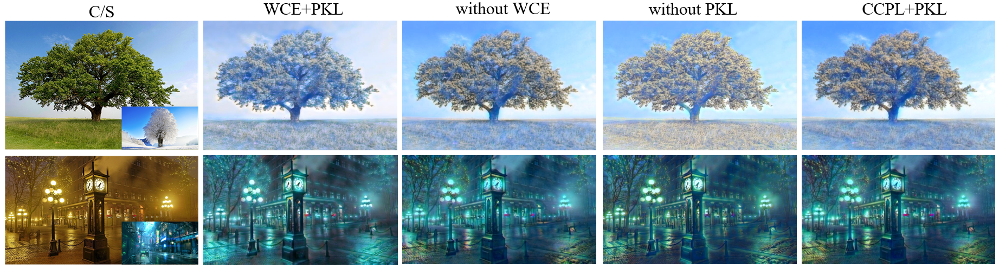
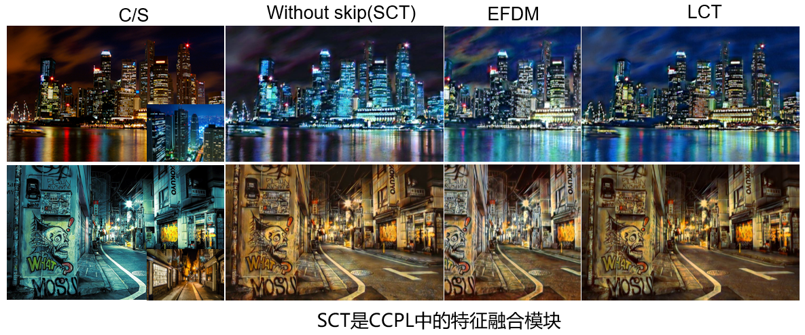

# Global-Local Feature Alignment Loss for Photorealistic Style Transfer

The problem that needs to be solved for photorealistic style transfer lies in limiting the distortion of texture details of the generated image based on the typical style transfer network. Although the existing methods achieve better stylization results, they lack sufficient style information because they do not consider the feature map comprehensively enough, leading to exposure or artifacts. This article proposes a loss function based on the contrast learning method to constrain the network to extract local and global information effectively. It ensures the consistency of distribution among regional blocks generated based on anchor points and the consistency of comparison between anchor points of the resulting image and content image in their neighborhood. This ensures consistency between local and global information comparisons. To ensure that the network is simple and effective and that enough information is extracted, this article proposes a linear covariance transformation network to achieve faithful stylization by effectively fusing feature first-order statistics with second-order statistics. Experiments show that the proposed method can faithfully achieve realistic stylization and satisfying visual effects.

## Increase the result image after replacing WCE to CCPL in Figure 3



Since each negative sample has a different influence on the positive sample, we can make a better comparison if we weight each negative sample according to its correlation with the positive sample.

In the comparison of the second column and the last column, we replaced WCE to CCPL. It can be seen that without the weight of negative samples, the leaves in the tree still maintain more color in the content image;  in the second row, the color of the road also keep more color in the content image.

## Change “without skip” in Figure 4 to SCT



Our LCT module is completed on the basis of SCT module in CCPL. We added skip connection, and in the absence of skip connection, the LCT module is actually the SCT module in the CCPL.


# Train the model

```python
python train.py \
--content_dir=datasets/COCO2017 \
--style_dir=Wikiart \
```

# Test the model

```
python test.py \
--content_dir=test/content \
--style_dir=test/style \
--decoder=experiments/decoder_iter_160000.pth.tar \
--LCT=experiments/lct_iter_160000.pth.tar \
```

### Acknowledgments

The Weighted Contrast Estimation(WCE) loss and the Linear Covariance Transformation network is based on project [CCPL](https://github.com/JarrentWu1031/CCPL) and [MoNCE](https://github.com/fnzhan/MoNCE). We sincerely thank them for their great work.